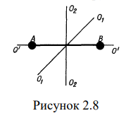
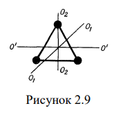

#  Закон равномерного распределения энергии по степеням свободы

Числом степеней свободы тела называется наименьшее число координат
(число независимых координат), которые необходимо задать для того, чтобы
полностью определить положение тела в пространстве.
Например, материальная точка, свободно движущаяся в пространстве,
имеет три степени свободы: координаты х, у и z: Материальная точка,
движущаяся на плоскости, имеет две степени свободы: координаты х и у.
Абсолютно твердое тело имеет шесть степеней свободы. Его положение в
пространстве определяется тремя координатами центра масс, двумя
координатами, определяющими положение в пространстве определенной оси,
проходящей через центр масс и какую-либо другую фиксированную точку
тела, и, наконец, углом поворота тела вокруг этой оси по отношению к
некоторому начальному положению. Таким образом, абсолютно твердое тело
обладает тремя степенями свободы поступательного движения и тремя
степенями свободы вращательного движения.
Если тело не абсолютно твердое и его части могут смещаться друг
относительно друга, то необходимо рассматривать дополнительные степени
свободы колебательного движения.
Молекулу одноатомного газа можно рассматривать
как материальную точку, потому что практически вся
масса такой частицы сосредоточена в атомном ядре,
размеры которого весьма малы.
Такая молекула (точнее, атом) имеет три степени
свободы поступательного движения (i =3). Ранее мы
отмечали, что средняя кинетическая энергия
одноатомной молекулы идеального газа определяется по формуле:

$w_{пост}=\frac{3}{2}kT$

Так как такая молекула обладает тремя степенями
свободы, и все степени свободы равноправны, то на одну
степень свободы поступательного движения приходится
в среднем энергия
$w_1=\frac{1}{2}kT$

Двух-, трех- и многоатомные молекулы нельзя
рассматривать как материальные точки. Молекула двухатомного газа в первом
приближении представляет собой два жестко связанных атома А и В, находящихся на некотором расстоянии друг от друга. Такая молекула напоминает
гимнастическую гантель с невесомой ручкой (рис. 2.8). Она, помимо трех
степеней свободы поступательного движения, имеет еще две степени свободы
вращательного движения вокруг осей О1-О1 и О2-О2. Вращение вокруг третьей
оси O’ – O’ не рассматривается, так как момент инерции атомов относительно
этой оси очень мал и, следовательно, весьма мала кинетическая энергия
молекулы, связанная с этим вращением. Молекулы, состоящие из трех (и более) жестко связанных атомов (рис.2.9), имеют, подобно абсолютно твердому
телу, шесть степеней свободы: три степени свободы поступательного
движения и три степени свободы вращательного движения.
Модель молекулы в виде жестко связанных атомов является чрезмерно
упрощенной. Во многих случаях приходится учитывать возможность

относительных смещений атомов в молекуле, т.е. вводить в рассмотрение
колебательные степени свободы. Например, нежесткая двухатомная молекула
(см. рис.2.8) имеет одну колебательную степень свободы, а нежесткая
трехатомная молекула - три колебательные степени свободы. При
колебательном движении молекула имеет и кинетическую, и потенциальную
энергии. Если колебания гармонические, то в среднем эти энергии равны друг
другу.
Какой же вклад вносят дополнительные степени свободы вращательного
движения в среднюю кинетическую энергию молекулы? Ответ на этот вопрос
дает важнейший закон статистической физики - закон Больцмана о равномерном распределении энергии по степеням свободы молекул: для
статистической системы, находящейся в состоянии термодинамического
равновесия, на каждую поступательную и вращательную степени свободы
приходится в среднем кинетическая энергия, равная kТ/2, а на каждую
колебательную степень свободы – в среднем энергия, равная kТ.
Колебательная степень обладает вдвое большей энергией потому, что на нее
приходится не только кинетическая энергия, но и потенциальная, причем
средние значения кинетической и потенциальной энергий одинаковы. Таким
образом, средняя энергия поступательного и вращательного движения
молекулы:

$w_{пост}=w_{вращ}=\frac{i}{2}kT$

где i – число степеней свободы соответственно поступательного или
вращательного движения. Средняя энергия колебательного движения

$w_{колеб}=i_{колеб}kT$

Полная средняя энергия молекулы:
$w=w_{пост}+w_{вращ}+w_{колеб}$

или 

$w={i_{пост}}{2}kT+{i_{вращ}}{2}kT+i_{колеб}kT$

Полное число степеней свободы молекулы:

$i=i_{пост}+i_{вращ}+i_{колеб}$
