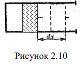
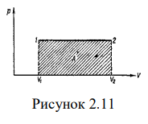
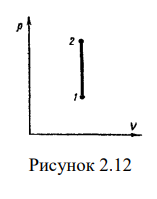

# 1) Изобарный процесс (давление газа постоянно, т.е. р = const)

Если при изобарном расширении газа от объема V1 до объема V2 поршень в
цилиндре перемещается на расстояние dх, [рис. (2.10)] , то работа, совершаемая
газом равна:

$dA=Fdx=pSdx=pdV$

$A=\int \limits_{V_{1}}^{V_{2}}pdV$

$A=p(V_{2}-V_{1})=p\Delta{V}$

где р – давление газа, $\Delta{V}$ - изменение его обьема.
Так как $PV_{1}=\frac{m}{u}RT_{1}$; $PV_{2}=\frac{m}{u}RT_{2}$.

$V_{2}-V{1}=\frac{m}{u} \frac{R}{p}(T_{2}-T_{1})$

$A=\frac{m}{u}R(T_{2}-T_{1})$

для 1 моля $A=R\Delta{T}$; т.е. при изобарном расширении 1 моля идеального газа
при нагревании его на 1 К R = А.
Таким образом, получаем, что универсальная газовая постоянная R равна
работе, которую совершает моль идеального газа при повышении его
температуры на один Кельвин при постоянном давлении.
 При изображении изобарного процесса расширения газа в координатных
осях p, V площадь фигуры, ограниченной графиком процесса, ординатами V1
и V2 , осью абсцисс, пропорциональна работе газа.
Учитывая выражение, уравнение первого начала термодинамики
можно записать следующим образом 

$\delta{U}=dU+pdV$

# 2) Изохорный процесс

При изохорном процессе постоянным остается
объем газа (V = const), следовательно, dV = 0 и никакой работы при таком
процессе совершить нельзя. Однако это не означает, что
изохорный процесс не находит практического применения.
Он может входить как составная часть в сложный цикл,
состоящий из нескольких различных процессов.
Процесс 1 $\rightarrow$ 2,
соответствует изохорному нагреванию.
Так как при изохорном процессе

$A=p\Delta{V}=0$; то из
первого начала термодинамики следует, что $Q=\Delta{U}$.  Для
1 моля изменение внутренней энергии

$\Delta{U}=\frac{I}{2}R\Delta{T}$.

Для произвольной массы газа

$\Delta{Q}=\Delta{U}=\frac{m}{u}\cdot \frac{i}{2}R\Delta{T}$

Произвольный процесс расширения газа от объема V1 до объема V2
можно представить как совокупность чередующихся изобарных и изохорных
процессов. При изохорных процессах работа равна нулю. Работа при
изобарных процессах пропорциональна площади фигуры на диаграмме p,V
под соответствующими участками изобары. Следовательно, работа при
произвольном расширении газа прямо пропорциональна площади фигуры под
соответствующим участком графика процесса на диаграмме p,V.
При сжатии газа направление вектора внешней силы совпадает с
направлением перемещения, поэтому работа А´ внешних сил положительна, а
работа совершенная газом – отрицательна. 
